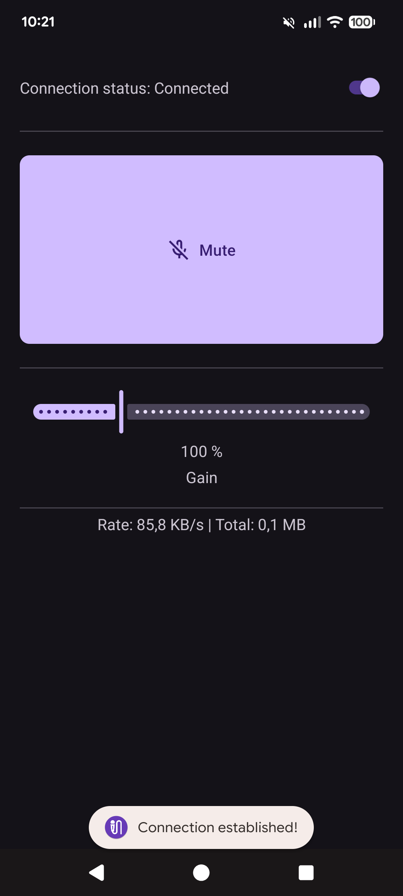

# Mica

Turn your Android phone into a wireless or USB-connected microphone for your Linux system.

## Features

- **Low Resource Usage:** Minimal CPU (~0.3% per core) and RAM (~5MB) footprint
- **Dual Connectivity:** Connect via Wi-Fi for convenience or USB tethering for low latency
- **Automatic Discovery:** Seamless service discovery using Zeroconf (mDNS)
- **Simple Setup:** Automatic audio device configuration on supported systems
- **Lightweight:** Only ~100KB of disk space required

## System Requirements

The following components are required on your Linux PC. Most mainstream distributions include these by default:

- [**Avahi**](https://avahi.org/) – Zeroconf DNS service discovery
- [**PulseAudio or PipeWire**](https://wiki.debian.org/PulseAudio) – Virtual audio device management
- [**Systemd**](https://systemd.io/) – Automatic service startup (optional; manual configuration needed for other init systems)

## Installation

### Linux Listener

#### Debian-based Systems

On Debian-based systems the .deb package in the GitHub releases is the easiest way to install:

1. Download the `.deb` package from the [Releases](https://github.com/acaimingus/Mica/releases) page
2. Install via GUI package manager or terminal:
   ```bash
   sudo apt install ./MicaListener_1.0.0_amd64.deb
   ```
3. **Important:** Restart your PC to activate the systemd service in your user session (logging out and back in is insufficient)

#### Arch-based Systems

For Arch Linux systems, an [AUR](https://aur.archlinux.org/packages/mica-bin) was created by [C9Glax](https://github.com/C9Glax).

A guide how to install an AUR package can be found [here](https://wiki.archlinux.org/title/Arch_User_Repository).

#### Manual Installation

For other systems:

1. Download the executable and place it in your preferred location (e.g., `/usr/bin/`)
2. Configure autostart according to your system's service manager (varies by distribution)

### Android Client

1. Download and install the Mica app on your Android phone from the [Releases](https://github.com/acaimingus/Mica/releases) page
2. Ensure the Linux listener is running on your PC
3. Open the Mica app and toggle the connection switch

## Usage

Once installed, connecting your phone to your PC is straightforward:

1. Start the listener on your PC
2. Open the Mica app on your Android phone
3. Toggle the connection switch to connect

### Connection Methods

**Wi-Fi (Recommended for convenience):**

- Ensure your phone and PC are on the same local network
- The app automatically discovers and connects to your PC

**USB Tethering (Lower latency):**

- Connect your phone to your PC via USB cable
- Enable USB Tethering in your Android settings
- Open the Mica app and toggle the connection switch
- The app automatically routes audio through the USB connection



## Performance

The listener is architected for minimal resource consumption (Measured on a system with a Ryzen 7 5700X and 16GB RAM):

| Resource | Usage |
|----------|-------|
| **CPU** | ~0.3% of a single core (active) |
| **RAM** | ~5MB active, ~1MB idle |
| **Storage** | ~100KB |

## Troubleshooting

### IP Address Caching Issues

When doing rapid, repeated connection attempts, the system might cache the IP associated with the service and try to reuse it, even if the phone has acquired a new IP-port combination. Resolve this by flushing the Avahi cache:

```bash
sudo systemctl restart avahi-daemon
```

## Development

### Development System Requirements

To compile the C++ listener from source the following packages are required on a Debian-based system:

```bash
cmake
ninja-build
build-essential
pkg-config
libavahi-client-dev
libopenal-dev
```

They can be installed with:

```bash
sudo apt install cmake ninja-build build-essential pkg-config libavahi-client-dev libopenal-dev
```

On other systems additional dependencies may be needed.

For developing the Android Client only Android Studio and the Android SDK are required.

For packaging source code, there is an instruction under `Packaging/PACKAGING.md`.

## Contributing

Contributions are welcome and greatly appreciated! If you find a bug or have a feature you would like to add, feel free to open an issue or submit a pull request. To contribute:

1. **Report Issues:** Use the provided issue template for bug reports and feature requests
2. **Submit Changes:** Fork the repository, make your changes, and submit a pull request

## License

Distributed under the MIT License. See [LICENSE](LICENSE) for details.
